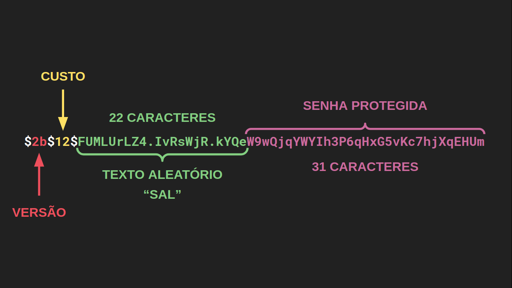

# Blog do código
> Um blog simples em Node.js
## Formato do hash gerado com o bcrypt
Olhando mais atentamente para os valores de senhaHash dos usuários, vemos que o resultado da função bcrypt.hash tem sempre o mesmo formato padrão. Isso é resultado de algumas propriedades específicas do algoritmo para tornar senhas seguras.

O primeiro prefixo, entre cifrões, é a versão do algoritmo. Pode incluir valores como 2b, 2a ou 2y.

Em seguida, temos o custo do algoritmo que nós escolhemos. Quanto maior for esse custo mais demorado será para o algoritmo ser executado e, dessa forma, é mais difícil de ser vítima de ataques de força bruta, onde o atacante experimenta várias senhas na tentativa de encontrar a correta. É importante notar que a cada incremento que nós damos no custo, o algoritmo demora duas vezes mais. E para aplicações modernas, um custo de 12 é considerado suficiente.

Já os 22 caracteres depois do último cifrão formam um texto aleatório, frequentemente apelidado de salt (do inglês “sal”). Esse texto é misturado à senha no algoritmo que gera a senha protegida. Isso dificulta que atacantes consigam pré-computar tabelas de senhas na tentativa de reverter essas funções. O salt é gerado toda vez que chamamos 'bcrypt.hash`, por isso o resultado sempre muda.

Por fim, os últimos 31 caracteres são a senha protegida de fato.



Assim, por causa desse formato, o bcrypt consegue recuperar as informações necessárias para comparar a senha recebida do cliente com a senhaHash do seu usuário, guardada no banco de dados.

## Usando chaves públicas
se você estiver numa situação com um servidor que gera os tokens e um ou mais servidores diferentes que verificam os tokens, então é necessário utilizar um algoritmo assimétrico para assinatura. Os mais comuns são o RS256 (assinatura do RSA + SHA256) e ES256 (assinatura do ECDSA + SHA256). Como escolher eles? Basicamente, o RSA é mais rápido mas o ECDSA permite chaves menores, então é uma escolha que depende do seu caso. De qualquer forma, ambos os métodos são bem mais lentos e complexos que o HMAC.

Vamos ver então um exemplo de JWT com o algoritmo RS256. Primeiro, é preciso gerar as chaves pública e privada. Para isso, podemos criar um programa generate-keys.js como o abaixo:

```
const fs = require('fs');
const { generateKeyPair } = require('crypto');

// substituir 'senha super secreta' por uma senha aleatória 
// e guardada em variável de ambiente
const senha = 'senha super secreta';

generateKeyPair('rsa', {
  modulusLength: 4096,
  publicKeyEncoding: {
    type: 'spki',
    format: 'pem'
  },
  privateKeyEncoding: {
    type: 'pkcs8',
    format: 'pem',
    cipher: 'aes-256-cbc',
    passphrase: senha
  }
}, (erro, chavePublica, chavePrivada) => {
    fs.writeFileSync('public.pem', chavePublica);
    fs.writeFileSync('private.key', chavePrivada);
    }
);
```

Com isso, ao rodar o programa com node generate-keys.js no seu servidor de autenticação, você vai gerar dois arquivos:

 - public.pem, com a chave pública;
 - private.key, com a chave privada criptografada.
Assim, para gerar os tokens, seu servidor de autenticação deverá fazer algo da forma

```
const fs = require('fs');
const jwt = require('jsonwebtoken');

// o arquivo 'private.key' pode não estar no mesmo diretório que o programa
const privateKey = fs.readFileSync('private.key');

// substituir 'senha super secreta' pela senha usada na geração
// das chaves e guardada em variáveis de ambiente
const senha = 'senha super secreta';

const token = jwt.sign(
    payload,
    { key: privateKey, passphrase: senha},
    { algorithm: 'RS256', expiresIn: tempoExpiracao }
);
```

e, para verificar o token, os outros servidores podem executar

```
// [...]
const fs = require('fs');
const jwt = require('jsonwebtoken');

// o modo como o serviço adquire a chave pública pode
// variar de acordo com a implementação
const publicKey = fs.readFileSync('public.pem');

const payload = jwt.verify(token, publicKey);
// [...]
```
É importante notar que essa é uma implementação mais complexa, principalmente pela administração adicional das chaves que é preciso ser feita. Por isso, é recomendado ler esse artigo da Ping identity(em inglês) que explica as considerações adicionais de segurança que você precisará ter.